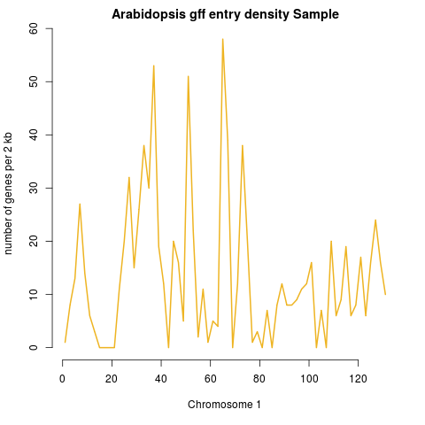

```{r setup, include=FALSE}
knitr::opts_chunk$set(echo = TRUE)
```

# Plot genome annotation from .gff
The sample .gff I used is downloadable at [arabidopsis.org](https://www.arabidopsis.org/download_files/Genes/TAIR10_genome_release/TAIR10_gff3/TAIR10_GFF3_genes_transposons.gff). The first part (only from Chromosome1) has been copied out and saved to the sample file `arabidopsis.sample.gff`.

```{r}
gff <- read.table("arabidopsis.sample.gff")

# if the file should be filtered for chromosome 1 entries only.
# gff <- gff[which(gff$V1 == "Chr1"),]

# separate datasets for genes/mRNA or whatever is desired
# mrna <- gff[which(gff$V3 == "mRNA"),]
gene <- gff[which(gff$V3 == "gene"),]
```


The start position of the gene is plotted, to show gene density independent of gene length. Gene density per 2 kb is plotted.
```{r}
# first plot
.hist <- hist(gene[, "V4"] / 1000, breaks= seq(0, (max(gene[, "V4"] / 1000) + 2), by=2), plot = F)

with(.hist, plot(mids, counts, pch=".", col="darkolivegreen", axes=F, main="Arabidopsis gene density Sample", ylab="number of genes per 2 kb", xlab="Chromosome 1"))
with(.hist, lines(mids, counts, col="darkolivegreen", lwd=2))
axis(2)
axis(1)
gff1 <- recordPlot()
# png("samplefigs/gff1_sample.png")
# gff1
# dev.off()
```


The .gff dataset is very small, therefore there are maximum 3 entries per bin. To illustrate how the plot looks with more data, the whole sample dataset is used. Per gene, there are entries for CDS, exon, ... so the plot biologically does not make sense, but prevents me from uploading a larger dataset.

```{r}
# first plot
.hist <- hist(gff[, "V4"] / 1000, breaks= seq(0, (max(gff[, "V4"] / 1000) + 2), by=2), plot = F)

with(.hist, plot(mids, counts, pch=".", col="goldenrod2", axes=F, main="Arabidopsis gff entry density Sample", ylab="number of genes per 2 kb", xlab="Chromosome 1"))
with(.hist, lines(mids, counts, col="goldenrod2", lwd=2))
axis(2)
axis(1)
gff2 <- recordPlot()
# png("samplefigs/gff2_sample.png")
# gff2
# dev.off()
```



I found the colors [here](http://www.stat.columbia.edu/~tzheng/files/Rcolor.pdf). A useful color R package with palletes of colors that can be distinguished by colorblind persons is [RColorBrewer](https://www.rdocumentation.org/packages/RColorBrewer/versions/1.1-2)